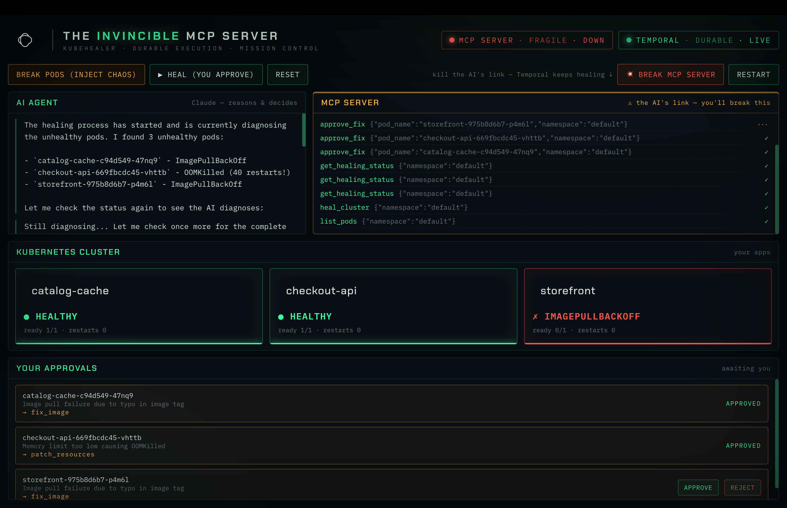
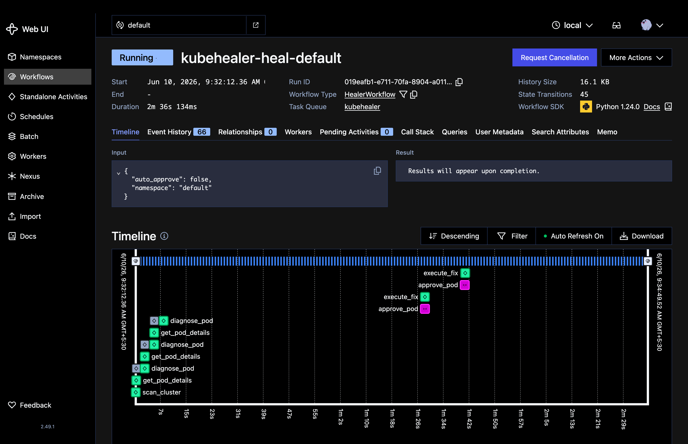

<div align="center">

# 🩺 KubeHealer

**An AI agent that heals broken Kubernetes pods — fronted by a crash-proof MCP server, made durable by Temporal.**

[](https://python.org)
[](https://temporal.io)
[](https://anthropic.com)
[](https://kubernetes.io)
[](LICENSE)

<br>

<!-- 📸 Add your screenshot at docs/images/dashboard.png -->


<sub><i>Mission Control — the fragile MCP plane, the durable Temporal plane, and the cluster healing live.</i></sub>

</div>

---

## The one idea

A normal MCP server keeps its work **inside the process** — kill it mid-task and the state, the LLM diagnoses, the in-flight progress all die with it. KubeHealer's MCP server keeps the work **inside Temporal** and is just a thin pointer to it:

```text
heal_cluster (MCP tool)   ──►  start HealerWorkflow   (id = kubehealer-heal-<ns>)
get_healing_status        ──►  HealerWorkflow.get_state      (query)
approve_fix / reject_fix  ──►  HealerWorkflow.approve/reject  (signals)
```

The Workflow ID is **deterministic per namespace**, so a crashed-and-restarted MCP server re-attaches to the same running heal by recomputing the ID — **no lost steps, no double-applied fixes.**

> 💥 **Kill the MCP server mid-heal → the Temporal workflow keeps running. Restart it → the client reconnects and finishes.** That contrast is the demo.

Deep dive with naive-vs-durable code: **[`CRASHPROOF_MCP.md`](CRASHPROOF_MCP.md)**.

## See it

Break the MCP plane and watch the durable plane carry on — proof lives in the Temporal Web UI:

<div align="center">
<!-- 📸 Add your screenshot at docs/images/temporal-ui.png -->


<sub><i>The heal workflow stays <b>Running</b> in Temporal even while the MCP server is dead.</i></sub>
</div>

## Quick start

Prerequisites: Python 3.11+, Docker, Kind, the Temporal CLI, an Anthropic API key.

```bash
./setup.sh                          # kind cluster + broken demo pods
pip install -r requirements.txt
cp .env.example .env                # paste your ANTHROPIC_API_KEY
```

Then one piece per terminal — **`make mcp` is the one you break**:

```bash
make temporal      # durable backend + Web UI (:8233)
make worker        # runs the workflows + activities
make mcp           # the MCP server   ← Ctrl-C this to break the demo
make dashboard     # Mission Control  (:8090)   — or `make agent` for the CLI
```

`make help` lists every target. Full recipes, ports, and the break-and-recover walkthrough: **[`RUN.md`](RUN.md)**.

## The demo, in three clicks

1. **Break Pods** → three services go red.
2. **Heal (you approve)** → the AI diagnoses each, then *each pod heals the moment you approve it*.
3. **💥 Break MCP Server** → the MCP plane flatlines, **Temporal stays LIVE and keeps healing** → **Restart** → it reconnects.

| Broken service | Problem | AI fix |
|---|---|---|
| `storefront` | image `nginx:latestt` (typo) | patch → `nginx:latest` |
| `checkout-api` | 10Mi limit + stress → OOMKilled | raise memory limit |
| `catalog-cache` | image `redis:latst` (typo) | patch → `redis:latest` |

## Architecture

```text
  CLI agent ┐                    ┌─────────────────────┐
  Dashboard ┼─ MCP (HTTP) ─────► │  MCP server         │  thin & disposable
  (clients) ┘   reconnects       │  (FastMCP)          │  — kill it anytime
                                 └──────────┬──────────┘
                              start · signal · query
                                            ▼
                       ┌──────────────────────────────────────┐
                       │  TEMPORAL · HealerWorkflow            │  durable plane —
                       │  scan → diagnose → approve → fix      │  state persisted
                       │  (each step a retryable activity)     │  every step
                       └──────────────────┬───────────────────┘
                                runs on the Worker
                                          ▼
                                   ┌────────────┐
                                   │ Kubernetes │  (local kind cluster)
                                   └────────────┘
```

The dashboard also reads Temporal + Kubernetes **directly**, so when the MCP plane flatlines the Temporal plane and pod cards keep advancing on screen.

## Drive it three ways

| Mode | Command | Talks via |
|---|---|---|
| **GUI** — Mission Control | `make dashboard` | MCP → Temporal |
| **CLI** — agent brain | `make agent` | MCP → Temporal |
| **Headless** — one-shot | `make auto` | Temporal |

Also: `make cli` (plain chat, Temporal-direct, no MCP) and `make mcp-naive` (the non-durable "before" server for the contrast).

## Stack

**Temporal** durable workflows · **Claude (Sonnet 4)** diagnosis + agent · **FastMCP** MCP server with SEP-1686 Tasks · **FastAPI + React** dashboard · **Kubernetes / kind** target cluster · **Python 3.11+**.

---

<div align="center">
<sub>Built for the AIOps India meetup — AIOps · AI agents · durable execution, in practice.</sub>
<br>
<sub>Built with Temporal durable execution and Claude AI.</sub>
</div>
